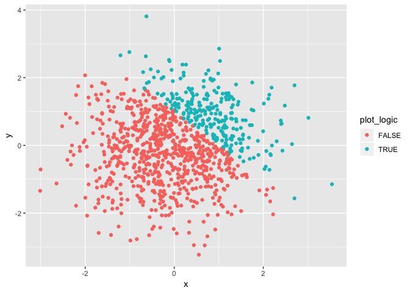
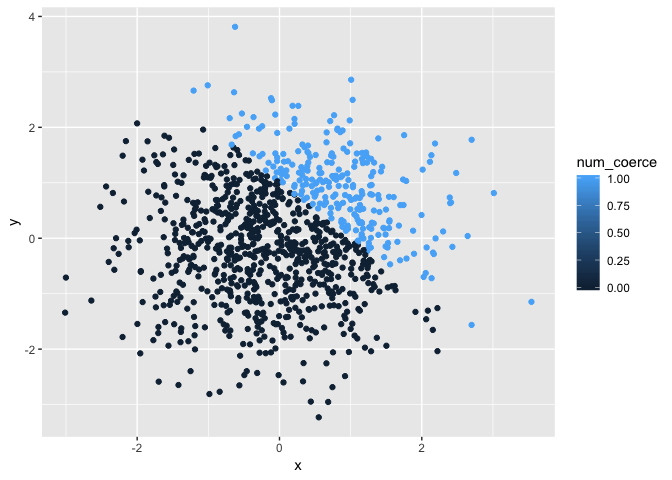
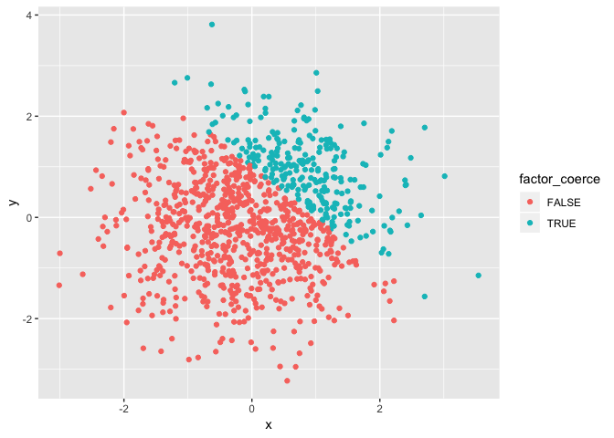

p8105\_hw1\_db3180
================
Divya Bisht
9/18/2018

Problem 1
---------

Creating a data frame:

``` r
  problem1_df = tibble( 
    first_dist = runif(10, min = 0, max = 5),
    a_logical = first_dist > 2,
    b_char = c("blue", "green", "blue", "green", "blue", "green", "blue", "green", "blue", "green"),
    c_factor = factor(b_char)
)
```

-   The mean of the first\_dist variable is 2.2029629.
-   The mean of the a\_logical variable is 0.6.
-   The mean of the b\_char variable is NA.
-   The mean of the c\_factor variable is NA.

It is only possible to take the mean of the first 'first\_dist' and 'a\_logical' vectors as they are numeric. The 'b\_char' and 'c\_factor' variables are characters and therefore cannot have a mean calculated.

**Converting variables using as.numeric**:

``` r
as.numeric(problem1_df$a_logical)
```

    ##  [1] 0 1 0 1 1 1 0 0 1 1

``` r
as.numeric(problem1_df$b_char)
```

    ## Warning: NAs introduced by coercion

    ##  [1] NA NA NA NA NA NA NA NA NA NA

``` r
as.numeric(problem1_df$c_factor)
```

    ##  [1] 1 2 1 2 1 2 1 2 1 2

The logical vector and the factor vector give outputs, but the character vector outputs "NA".

**Converting character variable from character to factor to numeric and converting factor variable from factor to character to numeric**

``` r
convert_char = as.factor(problem1_df$b_char)
as.numeric(convert_char)
```

    ##  [1] 1 2 1 2 1 2 1 2 1 2

``` r
convert_factor = as.character(problem1_df$c_factor)
as.numeric(convert_factor)
```

    ## Warning: NAs introduced by coercion

    ##  [1] NA NA NA NA NA NA NA NA NA NA

Converting the character variable from character to factor to numeric was possible, but converting the factor to character and then to numeric was not possible. This is because you can't convert character variables into numeric variables.

Problem 2
---------

**Dataframe:**

``` r
set.seed(10)

plot_df = tibble(
  x = rnorm(1000),
  y = rnorm(1000),
  plot_logic = x + y > 1,
  num_coerce = as.numeric(plot_logic),
  factor_coerce = as.factor(plot_logic)
  )
```

-   Size of the dataset: Rows: 1000, Columns: 5
-   Mean of x: 0.0113747
-   Median of x: -0.0030013
-   Proportion of cases for which the logical vector is true: 0.255

**Scatterplots:**

``` r
ggplot(plot_df, aes(x, y, color = plot_logic)) + geom_point()
```



``` r
ggsave("./Plot1_hw1.pdf")
```

    ## Saving 7 x 5 in image

-   The color scale above is showing the true/false logic of the logical variable, therefore only showing two colors in the color scale.

``` r
ggplot(plot_df, aes(x, y, color = num_coerce)) + geom_point()
```



-   The color scale is showing a gradient because it puts the plot on a continuous scale even though we have only two values. Therefore, only two colors show in the plot.

``` r
ggplot(plot_df, aes(x, y, color = factor_coerce)) + geom_point()
```



-   The color scale above only shows two options, similar to the scatterplot of the logical variable. Since this plot is of the logical variable converted to a factor variable, it is is showing the true/false options of the logical varible.
